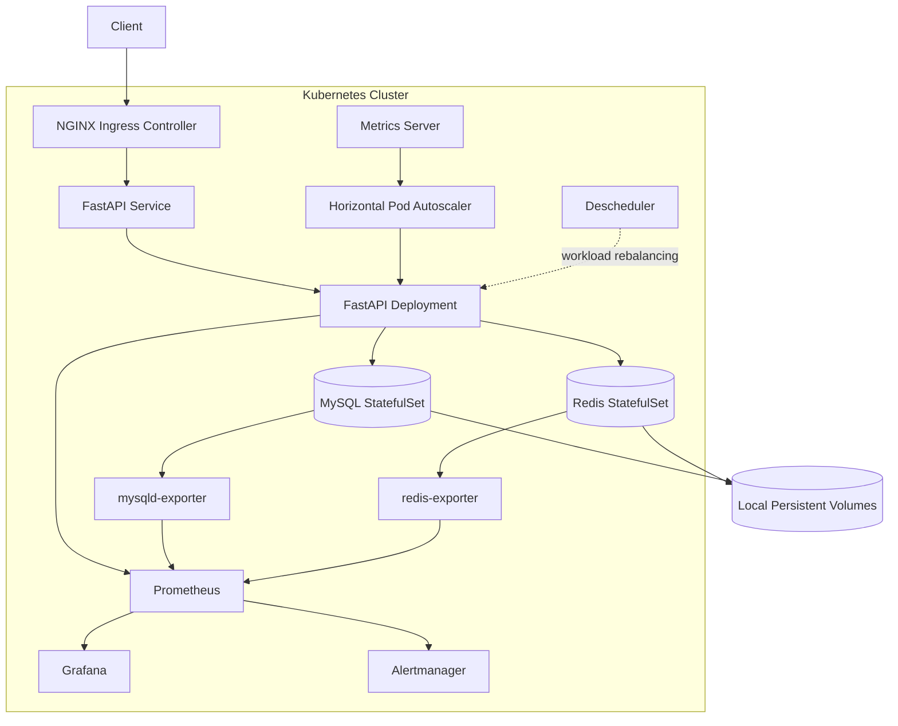

# OpsLab K8s

> Production-oriented Kubernetes SRE practice platform covering cluster engineering, stateful workloads, observability, autoscaling, persistent storage, and failure recovery.

OpsLab K8s 是一个围绕 **Kubernetes 运维与 SRE 实践**构建的完整实验平台。

项目从多节点 Kubernetes 集群搭建开始，逐步实现应用容器化部署、Ingress 流量入口、有状态服务持久化、自动扩缩容、Prometheus 可观测体系、备份恢复以及系统化故障演练。

与单纯“部署一套 Kubernetes 环境”不同，本项目重点关注：

- 工作负载发生故障时 Kubernetes 如何恢复
- 流量如何经过 Ingress、Service、EndpointSlice 到达 Pod
- MySQL / Redis 等有状态服务如何持久化
- HPA 如何根据指标自动扩缩容
- Prometheus / Grafana / Alertmanager 如何形成监控告警闭环
- 节点、Pod、数据库和监控组件发生故障后系统如何恢复
- 如何通过实际故障注入验证 Kubernetes 的可靠性机制

---

## Architecture



---

## Core Capabilities

### Kubernetes Infrastructure

- 基于 `kubeadm` 搭建多节点 Kubernetes 集群
- 使用 `containerd` 作为容器运行时
- 使用 Flannel 构建 Pod 网络
- 使用 Ansible 自动化基础环境与集群配置
- 对 Kubernetes 网络、调度、存储和控制器行为进行实际验证

### Application & Traffic

- FastAPI 应用容器化部署
- Deployment 多副本运行
- Service 提供集群内部访问入口
- NGINX Ingress 提供集群外部 HTTP 流量入口
- 配置 Liveness / Readiness Probe
- 验证：

```text
Client
  ↓
Ingress
  ↓
Service
  ↓
EndpointSlice
  ↓
Pod
```

完整流量链路

### Stateful Workloads

通过 StatefulSet 部署：

- MySQL
- Redis

重点实践：

- Stable Pod Identity
- PersistentVolumeClaim
- Local PersistentVolume
- Pod 重建后的数据恢复
- Pod 与存储生命周期分离
- Stateful workload 故障恢复

### Persistent Storage

使用 Local PV 为数据库提供持久化存储。

重点验证：

- Pod 删除后数据是否保留
- Pod 重建后 PVC / PV 是否重新关联
- 节点重启后的存储恢复
- Local PV 对 Pod 调度位置产生的约束
- 有状态应用与节点故障之间的关系

---

## Observability

项目构建了完整的 Kubernetes 可观测体系：

```text
Application / Kubernetes / MySQL / Redis
                    ↓
                Prometheus
                    ↓
          ┌─────────┴─────────┐
          ↓                   ↓
       Grafana           Alertmanager
      Dashboard             Alert
```

主要组件包括：

- Prometheus
- Grafana
- Alertmanager
- kube-state-metrics
- node-exporter
- mysqld-exporter
- redis-exporter

实现：

- Kubernetes 集群指标采集
- Node 资源监控
- Pod / Deployment 状态监控
- FastAPI 指标采集
- MySQL 指标采集
- Redis 指标采集
- Grafana Dashboard
- Alertmanager 告警
- Prometheus 数据持久化

---

## Autoscaling

通过：

```text
Metrics Server
      ↓
     HPA
      ↓
FastAPI Deployment
```

实现基于 CPU 指标的自动扩缩容。

验证内容包括：

- CPU 压力产生
- HPA Scale Out
- Pod 数量增加
- 压力解除
- HPA Scale In
- 工作负载重新收敛

不仅验证扩容，同时验证扩容后的恢复过程。

---

## Reliability Engineering

本项目没有停留在“组件部署成功”，而是通过主动故障注入验证 Kubernetes 和业务系统的真实恢复行为。

### Validated Failure Scenarios

| 故障场景 | 验证目标 |
| --- | --- |
| Application Pod 删除 | Deployment / ReplicaSet 自动恢复 |
| Redis 故障 | 应用依赖状态与恢复行为 |
| MySQL 故障 | 数据库依赖故障与应用状态变化 |
| CPU 压力 | HPA 自动 Scale Out / Scale In |
| Prometheus Target 故障 | 监控目标异常检测与告警 |
| Ingress → Service → Pod 链路异常 | Kubernetes 流量链路排查 |
| Worker Node 重启 | Pod 与持久化存储恢复 |
| Local PV 场景 | 节点、Pod、PVC、PV 调度关系 |
| MySQL Backup / Restore | 数据备份及恢复能力 |

---

## Health Check Design

FastAPI 应用分别提供：

```text
/healthz
/readyz
```

两类健康检查。

### Liveness

判断：

> 应用进程本身是否仍然可以正常工作。

### Readiness

判断：

> 当前实例是否已经具备接收业务流量的条件。

Readiness 同时考虑应用依赖的 MySQL / Redis 状态。

当实例不满足服务条件时：

```text
Readiness Probe Failure
        ↓
Pod Ready=False
        ↓
EndpointSlice ready=false
        ↓
Service 不再向该实例转发正常业务流量
```

从而将 **进程存活** 与 **业务可服务状态** 分离。

---

## Backup & Recovery

项目实现并验证 MySQL 数据备份 / 恢复流程。

目标不是单纯执行一次数据库 dump，而是验证：

```text
Backup
  ↓
产生备份数据
  ↓
模拟数据变化 / 丢失
  ↓
Restore
  ↓
验证恢复结果
```

相关脚本位于：

```text
scripts/
```

---

## Scheduling & Availability

项目进一步实践 Kubernetes 工作负载可用性和调度机制，包括：

- Pod Anti-Affinity
- PodDisruptionBudget
- Topology / Pod spreading
- Descheduler
- Controlled workload rebalancing

Descheduler 用于验证：

> 当集群拓扑或 Pod 分布发生变化后，如何在安全约束下重新优化工作负载分布。

---

## Repository Structure

```text
opslab-k8s/
├── ansible/
│   └── 基础环境与 Kubernetes 自动化配置
│
├── applications/
│   └── FastAPI 等业务应用
│
├── kubernetes/
│   └── Kubernetes manifests
│
├── images/
│   └── 项目相关镜像构建文件
│
├── scripts/
│   └── 部署、验证、备份恢复等脚本
│
├── docs/
│   └── 架构、故障演练和验证记录
│
└── ansible.cfg
```

---

## Engineering Evolution

项目不是一次性完成，而是通过持续迭代逐步建立完整 SRE 能力：

```text
Infrastructure Automation
        ↓
Kubernetes Cluster
        ↓
Container Networking
        ↓
Application Deployment
        ↓
Ingress Traffic
        ↓
Stateful Workloads
        ↓
Persistent Storage
        ↓
Metrics
        ↓
Autoscaling
        ↓
Observability
        ↓
Alerting
        ↓
Backup & Recovery
        ↓
Failure Injection
        ↓
Reliability Validation
        ↓
Scheduling Optimization
```

完整工程演进过程保留在 Git Commit History 与 Git Tags 中。

---

## SRE Design Principles

本项目实践的核心原则包括：

### Desired State

通过 Kubernetes Controller 持续维护：

```text
Desired State ≈ Actual State
```

而不是通过人工脚本维持 Pod 数量。

### Health-based Traffic Admission

Pod 存活并不代表 Pod 可以接受流量。

使用 Readiness 将：

```text
Process Alive
```

和：

```text
Ready To Serve
```

分离。

### Persistent State

数据库数据生命周期不能绑定 Pod 生命周期。

因此：

```text
Pod
```

与：

```text
PVC / PV
```

分别管理。

### Metrics-driven Scaling

扩缩容由实际资源指标驱动，而不是人工决定副本数量。

### Observability Before Recovery

发生故障时首先需要能够回答：

```text
What happened?
Where did it happen?
What was affected?
Did the system recover?
```

因此监控、指标和告警是可靠性工程的一部分，而不是附加功能。

### Validate, Don't Assume

只有实际执行故障注入并确认恢复结果后，才认为对应的可靠性能力通过验证。

---

## Project Status

| Area | Status |
| --- | --- |
| Kubernetes Cluster | ✅ Validated |
| Application Deployment | ✅ Validated |
| Stateful Workloads | ✅ Validated |
| Persistent Storage | ✅ Validated |
| Autoscaling | ✅ Validated |
| Observability | ✅ Validated |
| Alerting | ✅ Validated |
| Backup & Recovery | ✅ Validated |
| Failure Drills | ✅ Validated |
| Scheduling / Descheduler | ✅ Validated |

The repository is maintained as a Kubernetes / SRE engineering practice environment rather than a production service offering.
